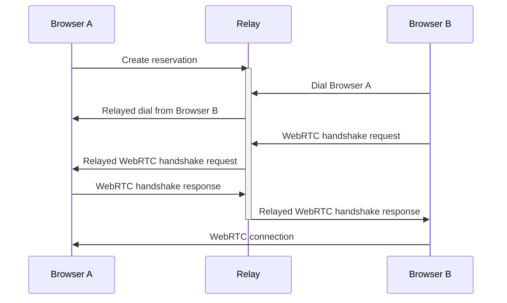

# @libp2p/example-browser-pubsub <!-- omit in toc -->

[](http://libp2p.io/)
[](https://discuss.libp2p.io)
[](https://codecov.io/gh/libp2p/js-libp2p-examples)
[](https://github.com/libp2p/js-libp2p-examples/actions/workflows/ci.yml?query=branch%3Amain)

> Demonstrates how to create a topic-based chat app using GossipSub in the browser with a modular relay/peer architecture.

This example leverages the [vite bundler](https://vitejs.dev/) to compile and serve the libp2p code in the browser. You can use other bundlers such as Webpack, but we will not be covering them here.

## Table of contents <!-- omit in toc -->

- [Project Structure](#project-structure)
- [Setup](#setup)
  - [Option 1: Install both modules](#option-1-install-both-modules)
  - [Option 2: Install only what you need](#option-2-install-only-what-you-need)
- [Running](#running)
  - [Why do I need a Relay Server?](#why-do-i-need-a-relay-server)
  - [Start the Relay Server](#start-the-relay-server)
  - [Running the Example](#running-the-example)
- [Browser UI](#browser-ui)
- [Topology](#topology)
- [Need help?](#need-help)
- [License](#license)
- [Contribution](#contribution)

## Project Structure

This project is organized into two independent modules:

```
relay/          - Circuit relay server (Node.js)
├── index.js    - Main relay server
├── package.json - Relay dependencies only
├── .env        - Relay configuration
└── README.md   - Relay-specific documentation

peer/           - Browser peer client
├── peer.js     - Browser peer logic
├── index.html  - Browser UI
├── package.json - Browser dependencies only
├── vite.config.js - Vite configuration
└── README.md   - Peer-specific documentation
```

Each module can be installed and run independently with its own dependencies.

## Setup

### Option 1: Install both modules

```console
git clone https://github.com/libp2p/js-libp2p-example-browser-pubsub.git
cd js-libp2p-example-browser-pubsub

# Install relay dependencies
cd relay
npm install
cd ..

# Install peer dependencies  
cd peer
npm install
cd ..
```

### Option 2: Install only what you need

**Relay only:**
```console
cd relay
npm install
```

**Peer only:**
```console
cd peer
npm install
```

## Running

This example has three components.  Two browser windows which will send pubsub messages and a relay server that they will use to establish the initial connection.

### Why do I need a Relay Server?

The only transport available to browser nodes that lets them be dialed by remote peers is the [WebRTC](https://www.npmjs.com/package/@libp2p/webrtc) transport.

This transport requires an initial [handshake](https://en.wikipedia.org/wiki/Session_Description_Protocol) to be done out-of-band, during which the two peers exchange their capabilities, addresses and open ports.

We use a [Circuit Relay](https://docs.libp2p.io/concepts/nat/circuit-relay/) server to establish an initial communication channel between the two browsers for this process, after which they will have negotiated a peer-to-peer connection and the relay will no longer be used.



### Start the Relay Server

For browsers to communicate, we first need to run the libp2p relay server:

```console
cd relay
npm start
```

The relay server will start on port 63000 by default (configurable via `.env`).

### Running the Example

In another terminal, start the browser peer:

```console
cd peer
npm start
```

This starts a Vite dev server and opens `http://localhost:3000`.

You can open this address in multiple browser tabs to see how they connect to each other automatically.

## Browser UI

The UI is basic but functional, featuring:

1. **Connection Status** - Shows your peer ID and connection status
2. **Topic Selection** - Join/leave different pubsub topics
3. **Peer List** - See all peers on your current topic
4. **Message History** - View all messages received on the current topic
5. **Send Messages** - Send messages to all peers on the current topic

Features:
- Automatic peer discovery through the relay
- Topic-based message filtering
- WebRTC connections established automatically between peers (DCUTR)
- Multiple topic support (switch between topics)
- Persistent relay peer ID across restarts

## Topology

This example uses:

1. **Circuit Relay Server** - A Node.js relay that helps browsers connect through NATs
2. **Browser Peers** - Multiple browser instances that connect via the relay and establish direct WebRTC connections
3. **GossipSub Protocol** - For efficient pubsub messaging between peers
4. **Topic Filtering** - Peers only see messages for topics they've joined

Peers first connect through the relay using WebSockets, then use DCUTR (Direct Connection Upgrade through Relay) to establish direct WebRTC connections for better performance.

## Need help?

- Read the [js-libp2p documentation](https://github.com/libp2p/js-libp2p/tree/main/doc)
- Check out the [js-libp2p API docs](https://libp2p.github.io/js-libp2p/)
- Check out the [general libp2p documentation](https://docs.libp2p.io) for tips, how-tos and more
- Read the [libp2p specs](https://github.com/libp2p/specs)
- Ask a question on the [js-libp2p discussion board](https://github.com/libp2p/js-libp2p/discussions)

## License

Licensed under either of

- Apache 2.0, ([LICENSE-APACHE](LICENSE-APACHE) / <http://www.apache.org/licenses/LICENSE-2.0>)
- MIT ([LICENSE-MIT](LICENSE-MIT) / <http://opensource.org/licenses/MIT>)

## Contribution

Unless you explicitly state otherwise, any contribution intentionally submitted
for inclusion in the work by you, as defined in the Apache-2.0 license, shall be
dual licensed as above, without any additional terms or conditions.
